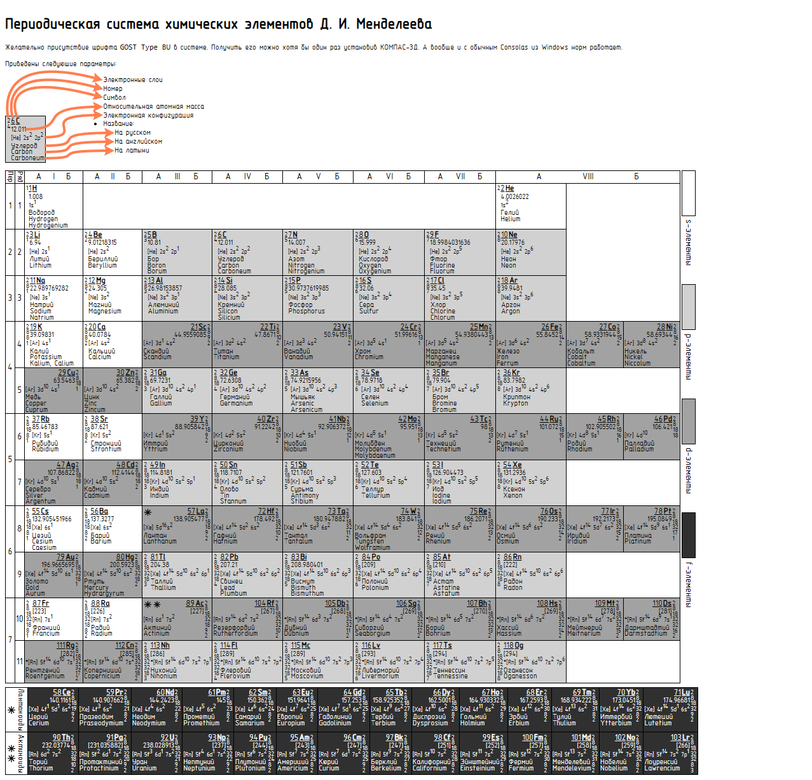

# rus-periodic-table-js

Периодическая таблица в стандартном для России коротком формате.

Желательно присутствие шрифта `GOST Type BU` в системе. Получить его можно хотя бы один раз установив КОМПАС-3Д. А вообще и с обычным Consolas из Windows норм работает.

Данные взяты из проекта [Periodic-Table-JSON](https://github.com/Bowserinator/Periodic-Table-JSON) и на всякий случай поставляются вместе с исходниками страницы в директории `public`.

